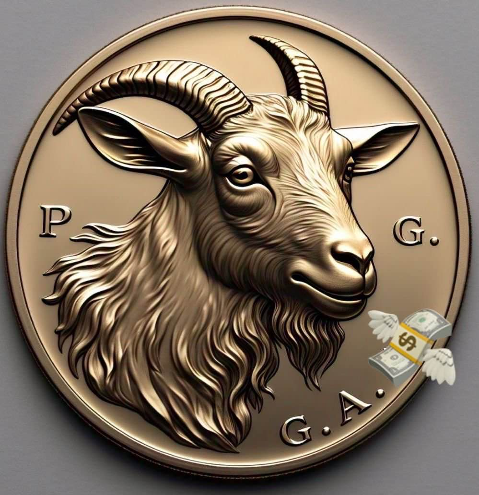
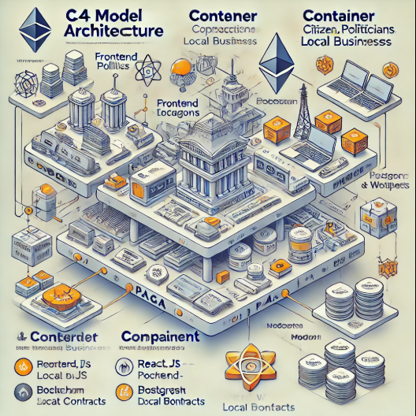
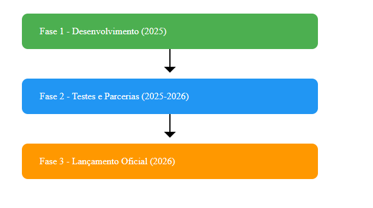

# P.A.G.A. – Promessa Assinada Gera Atitude

## Introdução

O **P.A.G.A.** (Programa de Participação e Ação Governamental Ativa) é uma plataforma inovadora que visa fortalecer a democracia, estimular a participação cidadã e promover maior transparência na gestão pública. O projeto incentiva os eleitores a monitorarem o cumprimento das promessas de campanha dos políticos e, como incentivo, recompensa essa fiscalização com tokens baseados em **tecnologia Web3**.

---

## 🎯 Objetivos

- ✅ Incentivar a população a acompanhar e fiscalizar os governantes.
- ✅ Criar uma relação direta entre promessas eleitorais e sua execução.
- ✅ Garantir maior transparência e engajamento cívico.
- ✅ Oferecer recompensas na forma de tokens Web3, que podem ser usados no comércio local.
- ✅ Implementar o **Selo de Político Confiável**, uma certificação que atesta a credibilidade dos políticos.

---

## 🛠️ Arquitetura baseada no Modelo de Blocos

### Visão Geral

A arquitetura do P.A.G.A. é estruturada para garantir escalabilidade, transparência e segurança. O diagrama abaixo ilustra os principais componentes do sistema e suas interações.

### Camadas da Arquitetura

1. **Camada de Interação do Usuário**
   - Eleitores
   - Políticos
   - Comércio Local

2. **Frontend (Aplicação Web3)**
   - Desenvolvido em **React.js + TailwindCSS**
   - Autenticação via carteiras Web3 (MetaMask, Trust Wallet)

3. **Backend (API & Lógica de Negócio)**
   - Implementado com **Node.js + NestJS**
   - Gerencia requisições da API e autenticação

4. **Camada Blockchain**
   - **Ethereum/Polygon** com contratos inteligentes **Solidity**
   - Armazena promessas, transações e distribuição de tokens

5. **Banco de Dados & Armazenamento**
   - **PostgreSQL** para dados estruturados
   - **IPFS** para armazenamento descentralizado de provas

6. **Sistema de Tokens & Recompensas**
   - Implementação de **tokens ERC-20 / ERC-721** para recompensas

7. **Oracles & Dados Externos**
   - Oráculos para integração com registros públicos governamentais

---

## 🚀 Como Funciona

1. 📌 **Registro e Autenticação**: Os cidadãos fazem login na plataforma usando carteiras Web3 como MetaMask.
2. 📝 **Monitoramento**: Os usuários podem registrar o acompanhamento de promessas de campanha dos políticos.
3. ✅ **Validação Comunitária**: Outras pessoas podem votar e verificar a veracidade das informações.
4. 🎁 **Recompensas com Tokens**: Com base na participação e na qualidade das informações fornecidas, os cidadãos recebem tokens.
5. 🛒 **Uso dos Tokens**: Os tokens podem ser usados em estabelecimentos parceiros do comércio local.
6. 🏅 **Selo de Político Confiável**: Políticos que cumprem suas promessas recebem um selo que melhora sua reputação pública.

---

## 🔧 Tecnologia Web3 Utilizada

O P.A.G.A. é baseado em tecnologia blockchain para garantir transparência e imutabilidade. 

### 🏗️ Componentes principais:

- 📝 **Smart Contracts (Contratos Inteligentes)**: Desenvolvidos em Solidity, armazenam e validam os registros das promessas eleitorais e a distribuição dos tokens.
- ⛓️ **Blockchain (Ethereum / Polygon / Solana)**: Utiliza uma blockchain eficiente para registros descentralizados e seguros.
- 🔑 **Carteiras Web3**: Compatibilidade com carteiras como **MetaMask, Trust Wallet** e outras para autenticação e recebimento de tokens.
- 🪙 **Tokens ERC-20 / ERC-721**: Implementação de um sistema de tokens para recompensas.
- 📂 **IPFS (InterPlanetary File System)**: Armazena provas de cumprimento de promessas de forma descentralizada.
- 🔗 **Oracles**: Uso de oráculos para integração com dados públicos e registros governamentais.

---

## 📅 Roadmap

### 📍 Fase 1 - Desenvolvimento (2025)
- 🚀 Criação do MVP
- 📌 Implementação dos contratos inteligentes
- 🎨 Desenvolvimento da interface Web3

### 📍 Fase 2 - Testes e Parcerias (2025-2026)
- 🔬 Testes beta com grupos selecionados
- 🛍️ Parcerias com comércios locais
- 📢 Avaliação da usabilidade e feedback

### 📍 Fase 3 - Lançamento Oficial (2026)
- 🎉 Lançamento público da plataforma

Contatos:

**GitHub**:

 [Repositório P.A.G.A](https://github.com/fenol64/p.a.g.a)  

[Fernando Oliveira](https://github.com/fenol64)   

[Marcus Vinicius de Araujo](https://github.com/mvrga)  

[Cássius Bessa](https://github.com/cassiusbessa)  

[Allan Dantas](https://github.com/allandantas21)

[Daniel Bessa](https://github.com/dwbessa)

[Eduardo Gomes](https://github.com/edgvi10)  

Vamos juntos construir um futuro mais transparente e participativo! 🚀

